# Container-Based Application Best Practices

Container-based applications are a modern approach to building, deploying, and running software in a consistent and efficient way. By packaging an application together with its dependencies into a container, developers can ensure that the application runs the same across development, testing, and production environments. This approach improves reliability, simplifies deployment, and makes applications easier to scale on local servers, cloud platforms, or container orchestration systems.


## Table of Contents

1. [History of Containers and Docker](https://github.com/dendie-sanjaya/best-practice-docker-build#1-history-of-containers-and-docker)
2. [When Should Containers Be Used?](https://github.com/dendie-sanjaya/best-practice-docker-build#2-when-should-containers-be-used)
3. [Container-Based Application Flow](https://github.com/dendie-sanjaya/best-practice-docker-build#3-container-based-application-flow)
  - [Local Developer Environment (Build Phase)](https://github.com/dendie-sanjaya/best-practice-docker-build#31-local-developer-environment-build-phase)
    - [Source Code](https://github.com/dendie-sanjaya/best-practice-docker-build#312-source-code)
    - [Dockerfile](https://github.com/dendie-sanjaya/best-practice-docker-build#313-dockerfile)
    - [Docker Build](https://github.com/dendie-sanjaya/best-practice-docker-build#314-docker-build)
    - [Docker Scan Vulnerability Image](https://github.com/dendie-sanjaya/best-practice-docker-build#315-docker-scan-vulnerability-image)
    - [Docker Tag](https://github.com/dendie-sanjaya/best-practice-docker-build#316-docker-tag)
    - [Docker Repository](https://github.com/dendie-sanjaya/best-practice-docker-build#317-docker-repository)
    - [Docker Login](https://github.com/dendie-sanjaya/best-practice-docker-build#318-docker-login)
    - [Docker Push](https://github.com/dendie-sanjaya/best-practice-docker-build#319-docker-push)
  - [Server Environment](https://github.com/dendie-sanjaya/best-practice-docker-build#32-server-environment)
    - [Docker Compose](https://github.com/dendie-sanjaya/best-practice-docker-build#321-docker-compose)
    - [Test Apps](https://github.com/dendie-sanjaya/best-practice-docker-build#322-test-apps)
      - [Portainer](https://github.com/dendie-sanjaya/best-practice-docker-build#3221-portainer)
      - [Application My App via Postman](https://github.com/dendie-sanjaya/best-practice-docker-build#3222-application-my-app-via-postman)


## 1. History of Containers and Docker

### Early Containers (Before Docker)
The idea of process isolation has existed for a long time. Examples include:
- **chroot (1979)** on Unix
- **FreeBSD Jails (2000)**
- **Linux VServer (2001)**
- **Linux Containers (LXC) (2008)**

These technologies use Linux features such as **namespaces** and **cgroups** to isolate applications.

### The Birth of Docker (2013)
Docker changed the industry by providing easy-to-use tools and open standards on top of existing container technologies. Docker makes it simple to package, distribute, and run applications consistently across environments.


## 2. When Should Containers Be Used?

Container-based development is suitable for:

- **Modern Application Development (Microservices)**  
  Each service runs in its own container.

- **Reliable Testing**  
  The testing environment is the same as production, so test results are more accurate.

- **Easy Deployment to Cloud or On-Premise**  
  Applications can be deployed and scaled on cloud platforms (AWS, Azure, GCP) or local servers using Kubernetes, Docker Engine, or Docker Compose.


## 3. Container-Based Application Flow

Below is the general flow of a container-based application:

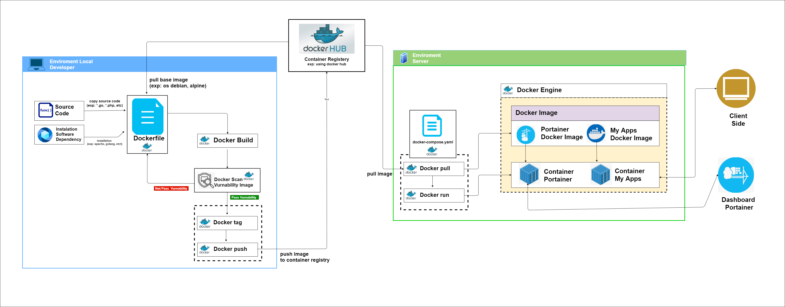


### 3.1 Local Developer Environment (Build Phase)

#### 3.1.1 Source Code
This folder contains the application source code.  
In this example, the application is written in **Golang** and provides two API endpoints.


#### 3.1.2 Dockerfile
A **Dockerfile** contains instructions to build a Docker image.

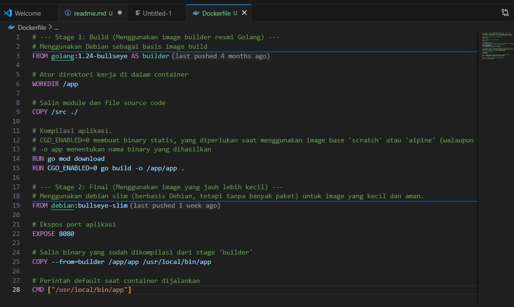

Main steps in the Dockerfile:
1. Choose a base image (example: `golang:1.24-bullseye`)
2. Copy the source code into the image
3. Compile the Go application


#### 3.1.3 Docker Build
Docker Build is the process of creating a Docker image from a Dockerfile.

Command format:
```bash
docker build -t IMAGE_NAME:VERSION PATH
```

Example:
```bash
docker build . -t my-apps:1.0
```


#### 3.1.4 Docker Image Vulnerability Scan
This step checks the image for known security vulnerabilities.


- **Fail (Red Path)**: Critical vulnerabilities found, build must be fixed.
- **Pass (Green Path)**: Image is safe and can continue.


#### 3.1.5 Docker Tag
Docker Tag gives the image a name and version, and prepares it for upload to a container registry.

Example:
```bash
docker tag my-apps:1.0 dendie/my-apps:1.0
```

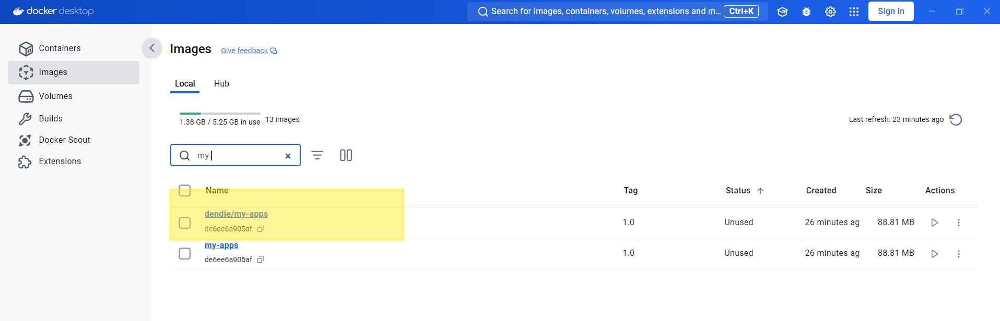


#### 3.1.6 Docker Repository
Prepare a repository in a container registry (example: Docker Hub).

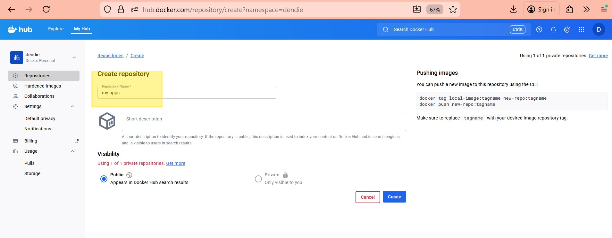
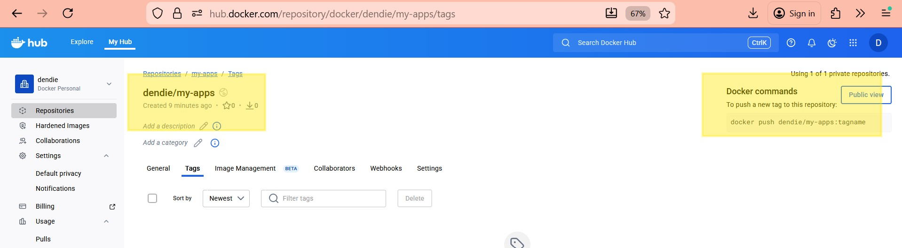


#### 3.1.7 Docker Login
Before pushing images, log in using an access token.

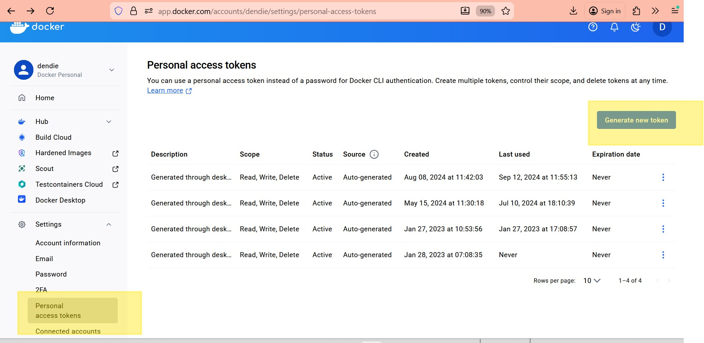
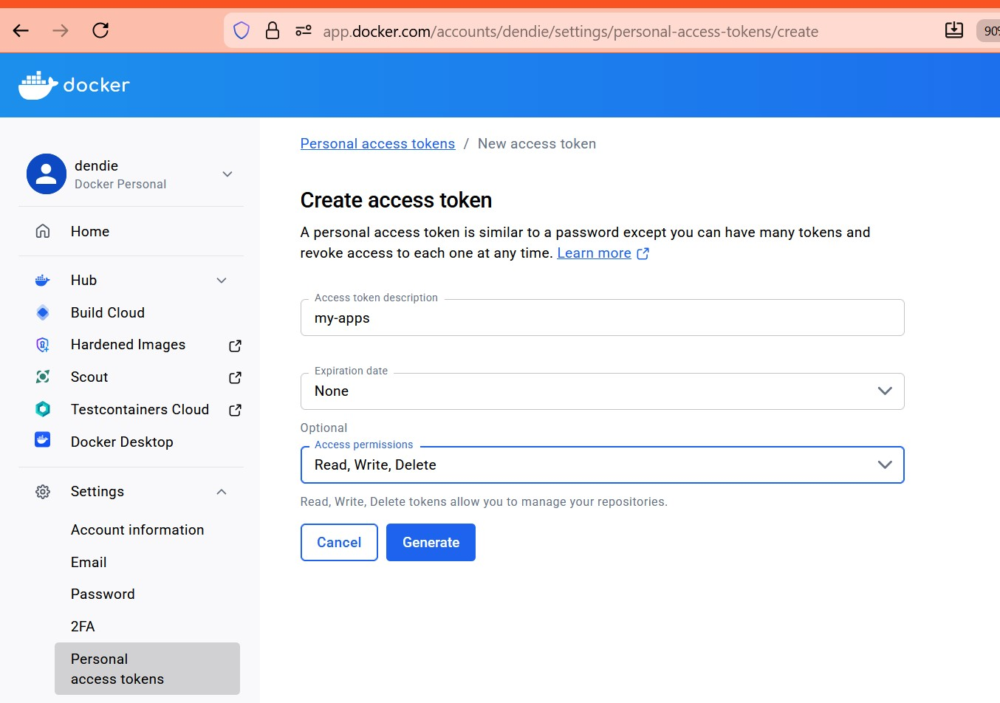
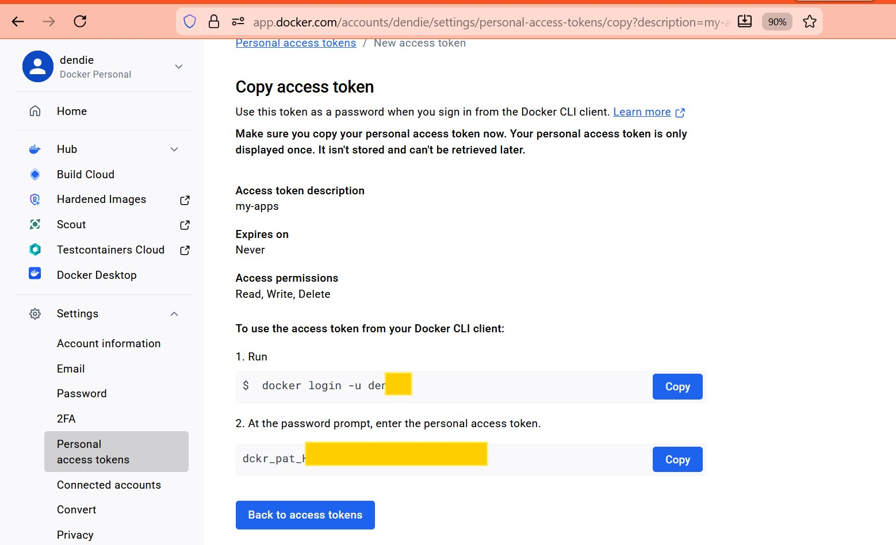
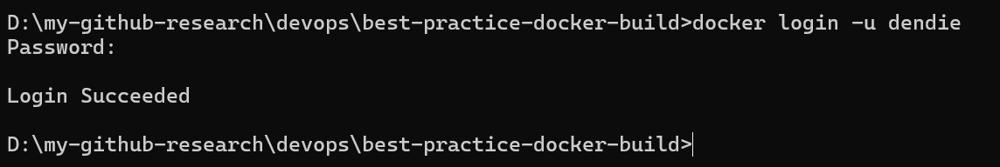


#### 3.1.8 Docker Push
Docker Push uploads the tagged image to Docker Hub so it can be used by servers.

Example:
```bash
docker push dendie/my-apps:1.0
```

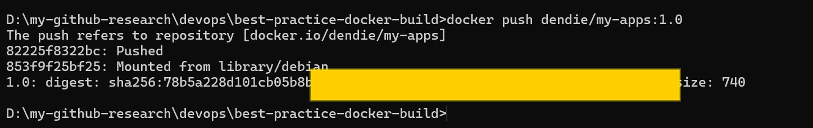
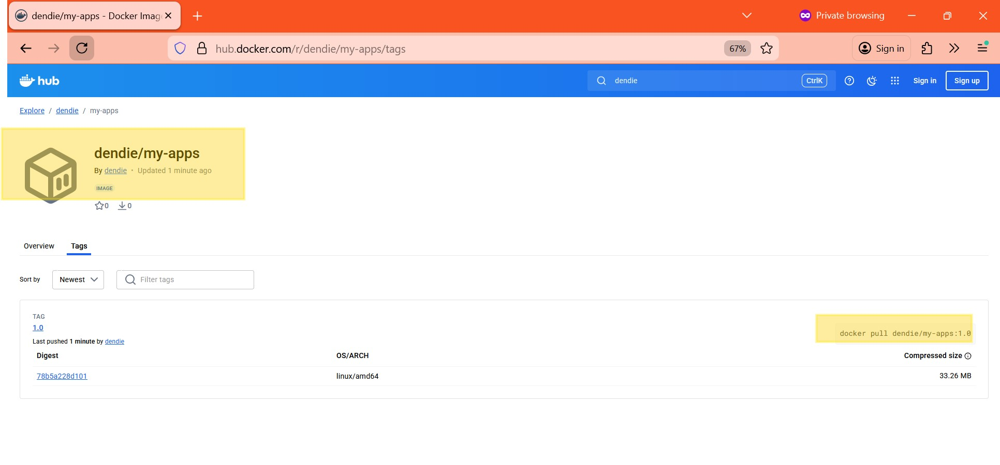


### 3.2 Server Environment

#### 3.2.1 Docker Compose
Docker Compose uses a YAML file to define which services should run, including:
- Application container
- Portainer (Docker UI management tool)


Run the services:
```bash
docker-compose up -d
```

Docker will:
1. Pull the application image from Docker Hub
2. Create and run containers for the application and Portainer


#### 3.2.2 Application Testing

##### 3.2.2.1 Portainer
Portainer provides a web UI to manage Docker.

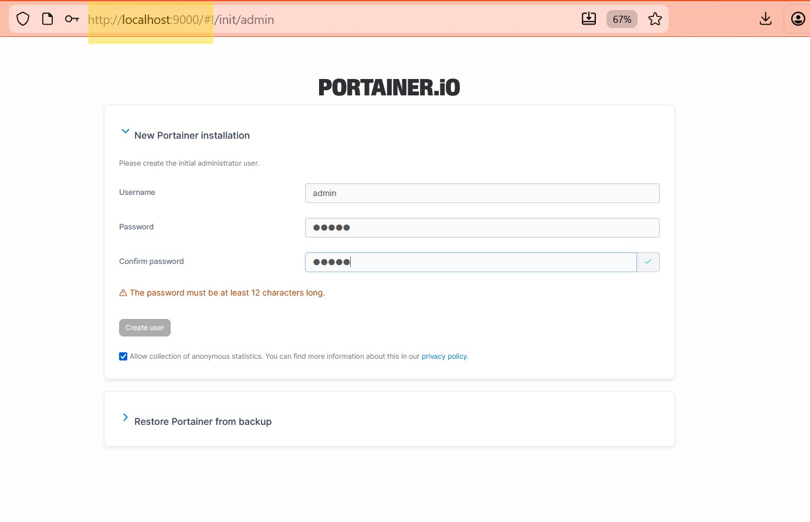
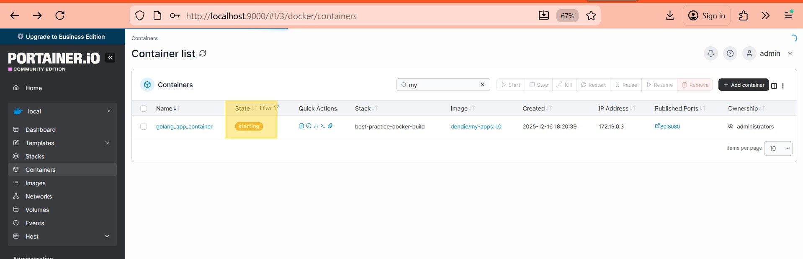
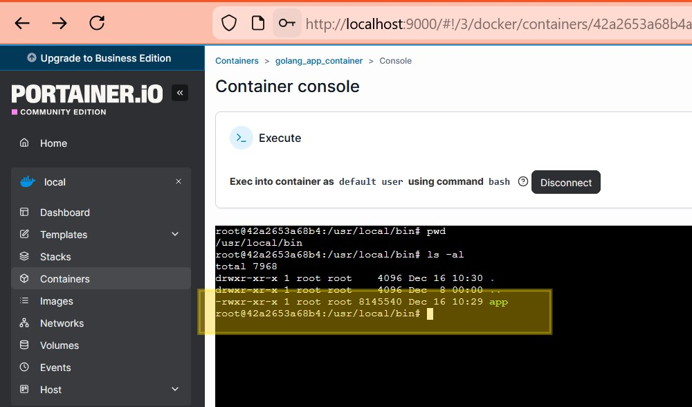


##### 3.2.2.2 Testing the Application with Postman
The application container can be tested using Postman.

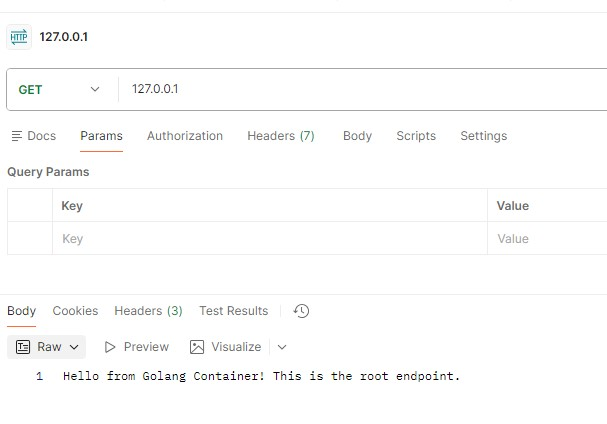

Health check endpoint test:

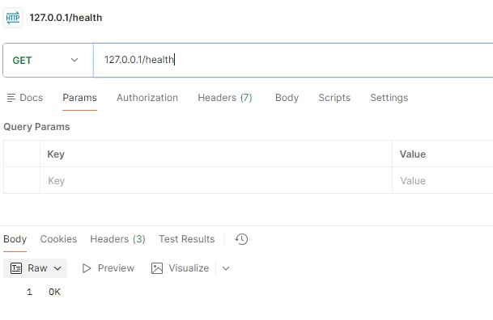
